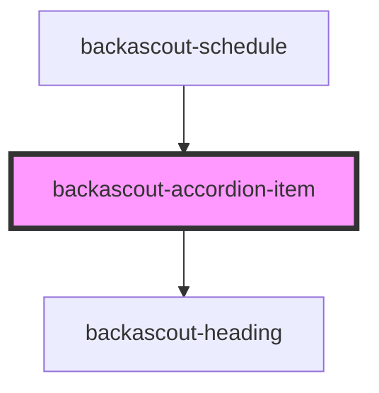

# backascout-accordion-item

<!-- Auto Generated Below -->

## Properties

| Property               | Attribute | Description | Type                                                       | Default                        |
| ---------------------- | --------- | ----------- | ---------------------------------------------------------- | ------------------------------ |
| `heading` _(required)_ | `heading` |             | `string`                                                   | `undefined`                    |
| `variant`              | `variant` |             | `"default" \| "error" \| "info" \| "success" \| "warning"` | `AccordionItemVariant.DEFAULT` |

## Dependencies

### Used by

 - [backascout-schedule](../../backascout-schedule/backascout-schedule)

### Depends on

- [backascout-heading](../../backascout-heading)

### Graph

----------------------------------------------

*Built with [StencilJS](https://stenciljs.com/)*
