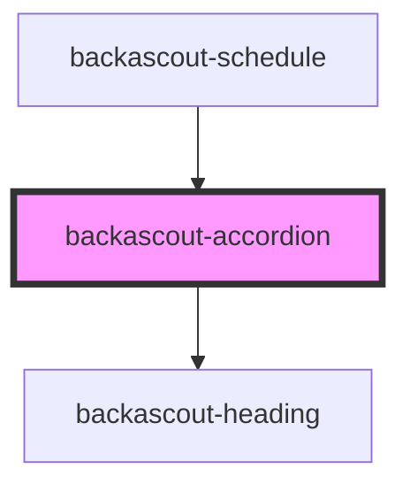

# backascout-accordion

<!-- Auto Generated Below -->

## Properties

| Property  | Attribute | Description | Type                                                                                                          | Default     |
| --------- | --------- | ----------- | ------------------------------------------------------------------------------------------------------------- | ----------- |
| `heading` | `heading` |             | `string`                                                                                                      | `undefined` |
| `variant` | `variant` |             | `"aventyrarna" \| "familjescouterna" \| "rover" \| "scouterna" \| "spararna" \| "upptackarna" \| "utmanarna"` | `undefined` |

## Dependencies

### Used by

 - [backascout-schedule](../../backascout-schedule/backascout-schedule)

### Depends on

- [backascout-heading](../../backascout-heading)

### Graph

----------------------------------------------

*Built with [StencilJS](https://stenciljs.com/)*
