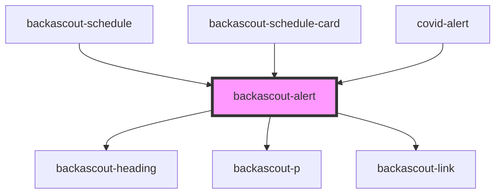

# backascout-alert

<!-- Auto Generated Below -->

## Properties

| Property               | Attribute   | Description | Type                                                       | Default                |
| ---------------------- | ----------- | ----------- | ---------------------------------------------------------- | ---------------------- |
| `body`                 | `body`      |             | `string`                                                   | `undefined`            |
| `heading` _(required)_ | `heading`   |             | `string`                                                   | `undefined`            |
| `linkHref`             | `link-href` |             | `string`                                                   | `undefined`            |
| `linkText`             | `link-text` |             | `string`                                                   | `undefined`            |
| `variant`              | `variant`   |             | `"default" \| "error" \| "info" \| "success" \| "warning"` | `AlertVariant.DEFAULT` |

## Dependencies

### Used by

 - [backascout-schedule](../backascout-schedule/backascout-schedule)
 - [backascout-schedule-card](../backascout-schedule/backascout-schedule-card)
 - [covid-alert](../covid-alert)

### Depends on

- [backascout-heading](../backascout-heading)
- [backascout-p](../backascout-p)
- [backascout-link](../backascout-link)

### Graph

----------------------------------------------

*Built with [StencilJS](https://stenciljs.com/)*
