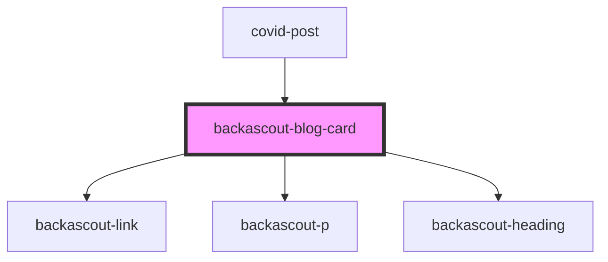

# backascout-blog-card

<!-- Auto Generated Below -->

## Properties

| Property               | Attribute   | Description | Type     | Default     |
| ---------------------- | ----------- | ----------- | -------- | ----------- |
| `badge`                | `badge`     |             | `string` | `undefined` |
| `body`                 | `body`      |             | `string` | `undefined` |
| `heading` _(required)_ | `heading`   |             | `string` | `undefined` |
| `href` _(required)_    | `href`      |             | `string` | `undefined` |
| `imageAlt`             | `image-alt` |             | `string` | `undefined` |
| `imageUrl`             | `image-url` |             | `string` | `undefined` |

## Dependencies

### Used by

 - [covid-post](../covid-posts/covid-post)

### Depends on

- [backascout-link](../backascout-link)
- [backascout-p](../backascout-p)
- [backascout-heading](../backascout-heading)

### Graph

----------------------------------------------

*Built with [StencilJS](https://stenciljs.com/)*
