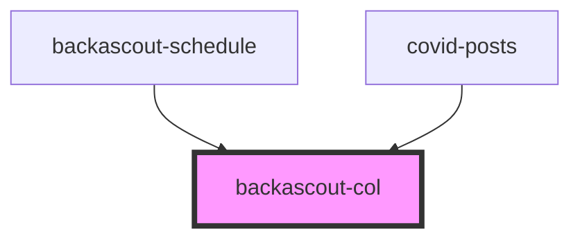

# backascout-col

<!-- Auto Generated Below -->

## Properties

| Property   | Attribute   | Description                                       | Type                                                                                                                                                 | Default     |
| ---------- | ----------- | ------------------------------------------------- | ---------------------------------------------------------------------------------------------------------------------------------------------------- | ----------- |
| `hideDown` | `hide-down` | Hide breakpoint on this breakpoint scope and down | `"md" \| "sm"`                                                                                                                                       | `undefined` |
| `hideUp`   | `hide-up`   | Hide column from this breakpoint up               | `"lg" \| "md" \| "sm"`                                                                                                                               | `undefined` |
| `width`    | `width`     | Column size                                       | `1 \| 2 \| 3 \| 4 \| 5 \| 6 \| 7 \| 8 \| 9 \| 10 \| 11 \| 12 \| "1" \| "2" \| "3" \| "4" \| "5" \| "6" \| "7" \| "8" \| "9" \| "10" \| "11" \| "12"` | `undefined` |
| `widthLg`  | `width-lg`  | Column size starting from LG breakpoint           | `1 \| 2 \| 3 \| 4 \| 5 \| 6 \| 7 \| 8 \| 9 \| 10 \| 11 \| 12 \| "1" \| "2" \| "3" \| "4" \| "5" \| "6" \| "7" \| "8" \| "9" \| "10" \| "11" \| "12"` | `undefined` |
| `widthMd`  | `width-md`  | Column size starting from MD breakpoint           | `1 \| 2 \| 3 \| 4 \| 5 \| 6 \| 7 \| 8 \| 9 \| 10 \| 11 \| 12 \| "1" \| "2" \| "3" \| "4" \| "5" \| "6" \| "7" \| "8" \| "9" \| "10" \| "11" \| "12"` | `undefined` |

## Dependencies

### Used by

 - [backascout-schedule](../../backascout-schedule/backascout-schedule)
 - [covid-posts](../../covid-posts/covid-posts)

### Graph

----------------------------------------------

*Built with [StencilJS](https://stenciljs.com/)*
