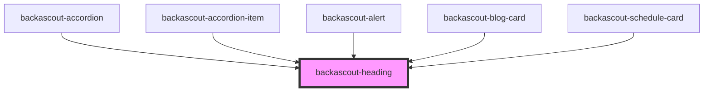

# backascout-heading

<!-- Auto Generated Below -->

## Properties

| Property  | Attribute | Description                            | Type                                                                                                                                  | Default                   |
| --------- | --------- | -------------------------------------- | ------------------------------------------------------------------------------------------------------------------------------------- | ------------------------- |
| `tag`     | `tag`     | The tag to render. This is mandatory.  | `"h1" \| "h2" \| "h3" \| "h4" \| "h5" \| "h6"`                                                                                        | `HTag.H1`                 |
| `variant` | `variant` | Determines the appearance of the text. | `"title-100" \| "title-200" \| "title-300" \| "title-400" \| "title-500" \| "title-600" \| "title-700" \| "title-800" \| "title-900"` | `HeadingVariant.TITLE100` |

## Dependencies

### Used by

 - [backascout-accordion](../backascout-accordion/backascout-accordion)
 - [backascout-accordion-item](../backascout-accordion/backascout-accordion-item)
 - [backascout-alert](../backascout-alert)
 - [backascout-blog-card](../backascout-blog-card)
 - [backascout-schedule-card](../backascout-schedule/backascout-schedule-card)

### Graph

----------------------------------------------

*Built with [StencilJS](https://stenciljs.com/)*
