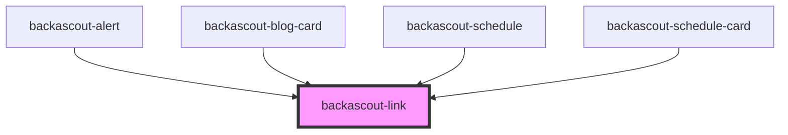

# backascout-link

<!-- Auto Generated Below -->

## Properties

| Property         | Attribute         | Description                                                                                                                           | Type                                                                                                                                                                                     | Default            |
| ---------------- | ----------------- | ------------------------------------------------------------------------------------------------------------------------------------- | ---------------------------------------------------------------------------------------------------------------------------------------------------------------------------------------- | ------------------ |
| `download`       | `download`        | Native download attribute of anchor element                                                                                           | `any`                                                                                                                                                                                    | `undefined`        |
| `href`           | `href`            | Native href attribute of anchor element                                                                                               | `string`                                                                                                                                                                                 | `undefined`        |
| `referrerPolicy` | `referrer-policy` | Native referrerPolicy attribute of anchor element                                                                                     | `"" \| "no-referrer" \| "no-referrer-when-downgrade" \| "origin" \| "origin-when-cross-origin" \| "same-origin" \| "strict-origin" \| "strict-origin-when-cross-origin" \| "unsafe-url"` | `undefined`        |
| `rel`            | `rel`             |                                                                                                                                       | `string`                                                                                                                                                                                 | `undefined`        |
| `silent`         | `silent`          | A silent link is intended to wrap an element to make it a link but not add any styling except for the pointer cursor and focus style. | `boolean`                                                                                                                                                                                | `false`            |
| `target`         | `target`          | Native target attribute of anchor element                                                                                             | `string`                                                                                                                                                                                 | `undefined`        |
| `variant`        | `variant`         | Determines if link is displayed on its own line (standalone) or within the current text content (text).                               | `"standalone" \| "text"`                                                                                                                                                                 | `LinkVariant.TEXT` |

## Dependencies

### Used by

 - [backascout-alert](../backascout-alert)
 - [backascout-blog-card](../backascout-blog-card)
 - [backascout-schedule](../backascout-schedule/backascout-schedule)
 - [backascout-schedule-card](../backascout-schedule/backascout-schedule-card)

### Graph

----------------------------------------------

*Built with [StencilJS](https://stenciljs.com/)*
