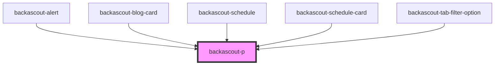

# backascout-p

<!-- Auto Generated Below -->

## Properties

| Property  | Attribute | Description                            | Type                                                                                                                                             | Default                         |
| --------- | --------- | -------------------------------------- | ------------------------------------------------------------------------------------------------------------------------------------------------ | ------------------------------- |
| `variant` | `variant` | Determines the appearance of the text. | `"additional-100" \| "overline-100" \| "overline-200" \| "paragraph-100" \| "paragraph-200" \| "preamble-100" \| "preamble-200" \| "subsection"` | `ParagraphVariant.PARAGRAPH100` |

## Dependencies

### Used by

 - [backascout-alert](../backascout-alert)
 - [backascout-blog-card](../backascout-blog-card)
 - [backascout-schedule](../backascout-schedule/backascout-schedule)
 - [backascout-schedule-card](../backascout-schedule/backascout-schedule-card)
 - [backascout-tab-filter-option](../backascout-tab-filter/backascout-tab-filter-option)

### Graph

----------------------------------------------

*Built with [StencilJS](https://stenciljs.com/)*
