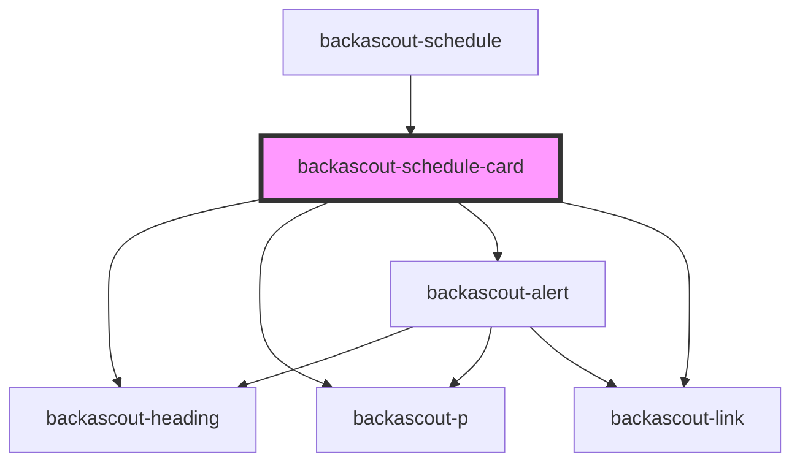

# backascout-schedule-card

<!-- Auto Generated Below -->

## Properties

| Property                       | Attribute              | Description | Type                                                                                                          | Default     |
| ------------------------------ | ---------------------- | ----------- | ------------------------------------------------------------------------------------------------------------- | ----------- |
| `activityDescription`          | `activity-description` |             | `string`                                                                                                      | `undefined` |
| `activityHeading` _(required)_ | `activity-heading`     |             | `string`                                                                                                      | `undefined` |
| `activityHref`                 | `activity-href`        |             | `string`                                                                                                      | `undefined` |
| `activityHrefLabel`            | `activity-href-label`  |             | `string`                                                                                                      | `undefined` |
| `cancelled`                    | `cancelled`            |             | `boolean`                                                                                                     | `false`     |
| `endDate` _(required)_         | `end-date`             |             | `string`                                                                                                      | `undefined` |
| `heading` _(required)_         | `heading`              |             | `string`                                                                                                      | `undefined` |
| `startDate` _(required)_       | `start-date`           |             | `string`                                                                                                      | `undefined` |
| `subheading`                   | `subheading`           |             | `string`                                                                                                      | `undefined` |
| `variant`                      | `variant`              |             | `"aventyrarna" \| "familjescouterna" \| "rover" \| "scouterna" \| "spararna" \| "upptackarna" \| "utmanarna"` | `undefined` |

## Dependencies

### Used by

 - [backascout-schedule](../backascout-schedule)

### Depends on

- [backascout-heading](../../backascout-heading)
- [backascout-p](../../backascout-p)
- [backascout-alert](../../backascout-alert)
- [backascout-link](../../backascout-link)

### Graph

----------------------------------------------

*Built with [StencilJS](https://stenciljs.com/)*
