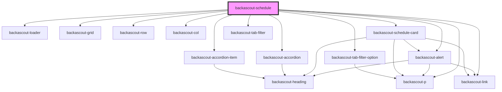

# backascout-schedule

<!-- Auto Generated Below -->

## Properties

| Property  | Attribute | Description | Type                                                                                                          | Default     |
| --------- | --------- | ----------- | ------------------------------------------------------------------------------------------------------------- | ----------- |
| `apiUrl`  | `api-url` |             | `string`                                                                                                      | `undefined` |
| `variant` | `variant` |             | `"aventyrarna" \| "familjescouterna" \| "rover" \| "scouterna" \| "spararna" \| "upptackarna" \| "utmanarna"` | `undefined` |

## Dependencies

### Depends on

- [backascout-loader](../../backascout-loader)
- [backascout-alert](../../backascout-alert)
- [backascout-grid](../../backascout-grid/backascout-grid)
- [backascout-row](../../backascout-grid/backascout-row)
- [backascout-col](../../backascout-grid/backascout-col)
- [backascout-schedule-card](../backascout-schedule-card)
- [backascout-accordion](../../backascout-accordion/backascout-accordion)
- [backascout-tab-filter](../../backascout-tab-filter/backascout-tab-filter)
- [backascout-tab-filter-option](../../backascout-tab-filter/backascout-tab-filter-option)
- [backascout-accordion-item](../../backascout-accordion/backascout-accordion-item)
- [backascout-p](../../backascout-p)
- [backascout-link](../../backascout-link)

### Graph

----------------------------------------------

*Built with [StencilJS](https://stenciljs.com/)*
