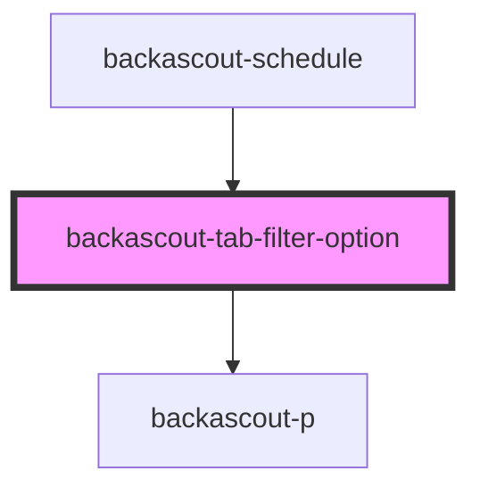

# backascout-tab-filter-option

<!-- Auto Generated Below -->

## Properties

| Property             | Attribute  | Description | Type                                                                                                          | Default     |
| -------------------- | ---------- | ----------- | ------------------------------------------------------------------------------------------------------------- | ----------- |
| `selected`           | `selected` |             | `boolean`                                                                                                     | `false`     |
| `value` _(required)_ | `value`    |             | `string`                                                                                                      | `undefined` |
| `variant`            | `variant`  |             | `"aventyrarna" \| "familjescouterna" \| "rover" \| "scouterna" \| "spararna" \| "upptackarna" \| "utmanarna"` | `undefined` |

## Events

| Event              | Description | Type                  |
| ------------------ | ----------- | --------------------- |
| `backascoutSelect` |             | `CustomEvent<string>` |

## Dependencies

### Used by

 - [backascout-schedule](../../backascout-schedule/backascout-schedule)

### Depends on

- [backascout-p](../../backascout-p)

### Graph

----------------------------------------------

*Built with [StencilJS](https://stenciljs.com/)*
