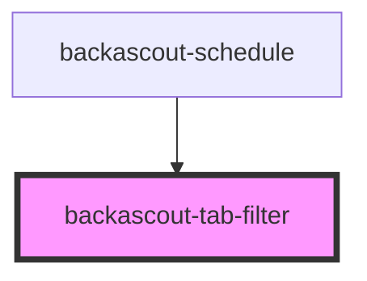

# backascout-tab-filter

<!-- Auto Generated Below -->

## Events

| Event              | Description | Type                  |
| ------------------ | ----------- | --------------------- |
| `backascoutSelect` |             | `CustomEvent<string>` |

## Slots

| Slot        | Description                                     |
| ----------- | ----------------------------------------------- |
| `"default"` | Expects <backascout-tab-filter-option> elements |

## Dependencies

### Used by

 - [backascout-schedule](../../backascout-schedule/backascout-schedule)

### Graph

----------------------------------------------

*Built with [StencilJS](https://stenciljs.com/)*
