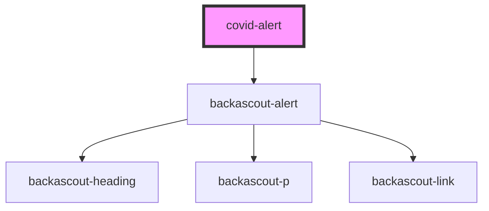

# covid-alert

<!-- Auto Generated Below -->

## Properties

| Property   | Attribute   | Description | Type     | Default     |
| ---------- | ----------- | ----------- | -------- | ----------- |
| `body`     | `body`      |             | `string` | `undefined` |
| `heading`  | `heading`   |             | `string` | `undefined` |
| `linkHref` | `link-href` |             | `string` | `undefined` |
| `linkText` | `link-text` |             | `string` | `undefined` |

## Dependencies

### Depends on

- [backascout-alert](../backascout-alert)

### Graph

----------------------------------------------

*Built with [StencilJS](https://stenciljs.com/)*
