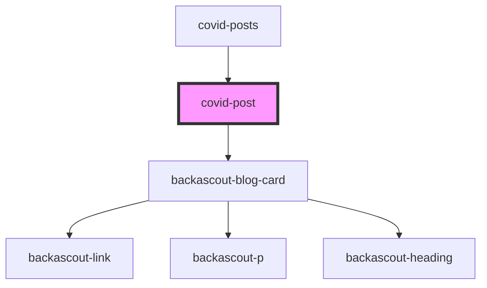

# covid-post

<!-- Auto Generated Below -->

## Properties

| Property      | Attribute       | Description | Type     | Default     |
| ------------- | --------------- | ----------- | -------- | ----------- |
| `host`        | `host`          |             | `string` | `undefined` |
| `postExcerpt` | `post-excerpt`  |             | `string` | `undefined` |
| `postLink`    | `post-link`     |             | `string` | `undefined` |
| `postMediaId` | `post-media-id` |             | `number` | `undefined` |
| `postTitle`   | `post-title`    |             | `string` | `undefined` |

## Dependencies

### Used by

 - [covid-posts](../covid-posts)

### Depends on

- [backascout-blog-card](../../backascout-blog-card)

### Graph

----------------------------------------------

*Built with [StencilJS](https://stenciljs.com/)*
