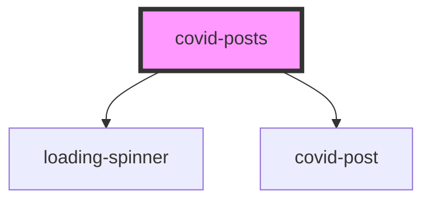

# covid-posts

<!-- Auto Generated Below -->

## Properties

| Property | Attribute | Description | Type     | Default     |
| -------- | --------- | ----------- | -------- | ----------- |
| `host`   | `host`    |             | `string` | `undefined` |

## Dependencies

### Depends on

- [loading-spinner](../loading-spinner)
- [covid-post](../covid-post)

### Graph

----------------------------------------------

*Built with [StencilJS](https://stenciljs.com/)*
